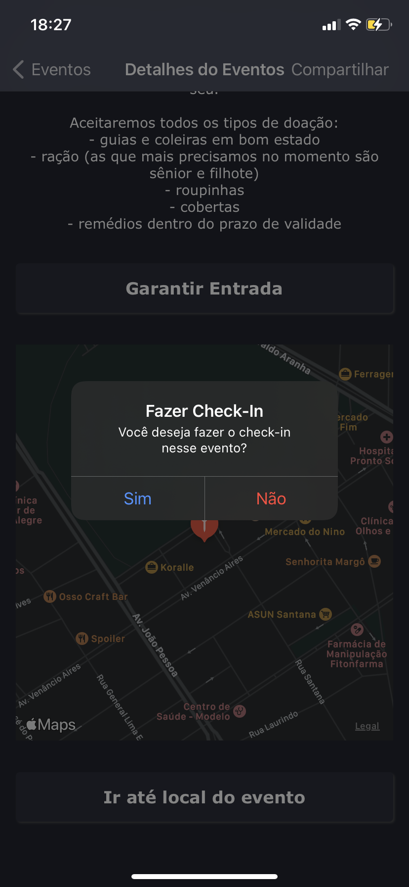

# Pattern-MVVM
 

Esse é um projeto desenvolvido para um teste do Woop-Sicredi.
Nesse projeto é utilizdo uma arquitetura MVVM com coordinator e uma camada de network, para isso foi utilizado a dependencia do Alamofire para realizar chamadas  API Rest.

## Screenshots Light Mode
  

 
## Screenshots Dark Mode

   
